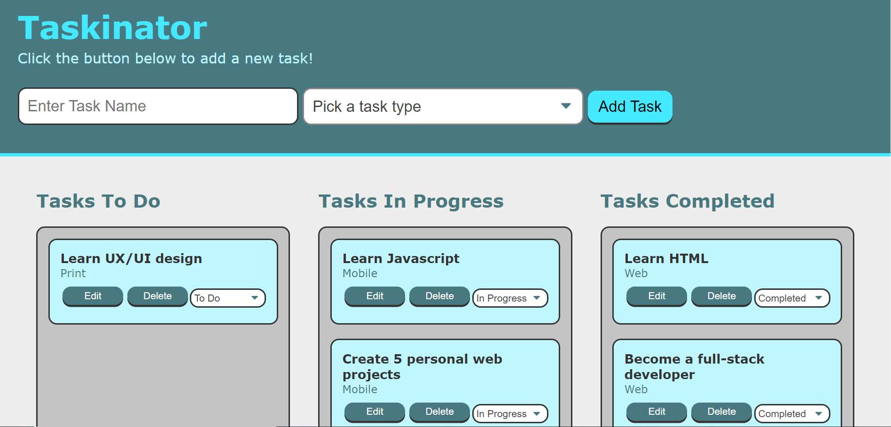

# taskinator

## Purpose
A dynamic interactive task-tracking web application. Taskinator allows you to create and organize your personal to do list. This application premits editing and deletion of tasks, as well as updating tasks' status with a drop down menu.

## Table Of Contents

* [Usage](#usage)
* [Technologies](#technologies)
* [Screenshots](#screenshots)
* [Contribution](#contribution)

## Usage

To run this website, visit the live application at https://jessicajeyanthiran.github.io/taskinator/  

## Technologies
* HTML
* CSS
* Javascript
* DOM API
* Web Storage API

## Screenshot

## Contribution
Made with ❤️ by Jessica Jeyanthiran

## Questions?

Contact me at 

Email: jeyanthiran.jessica@gmail.com

GitHub: https://github.com/JessicaJeyanthiran